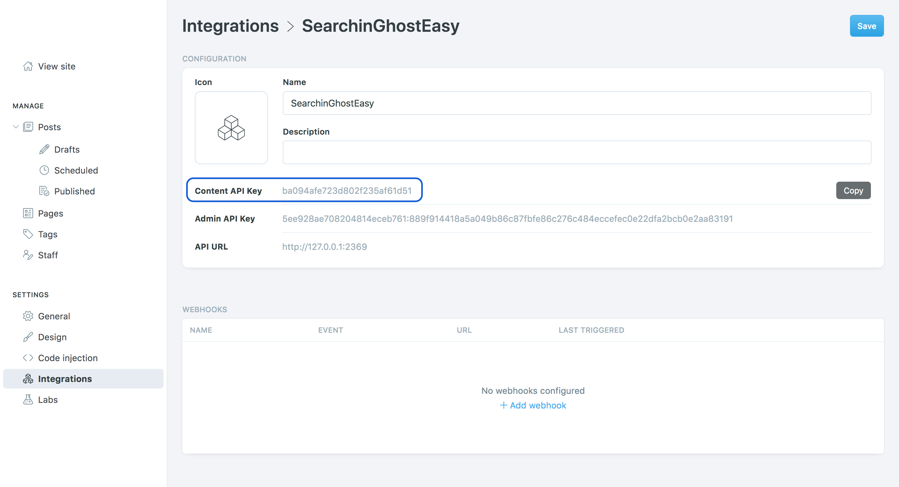
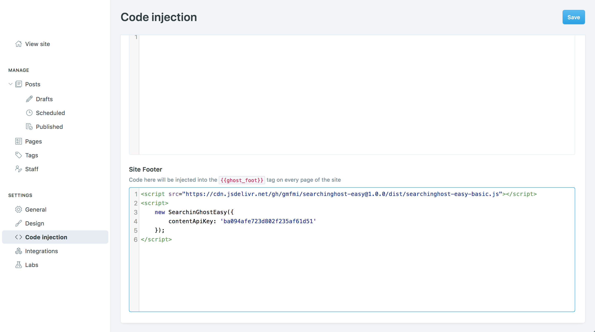
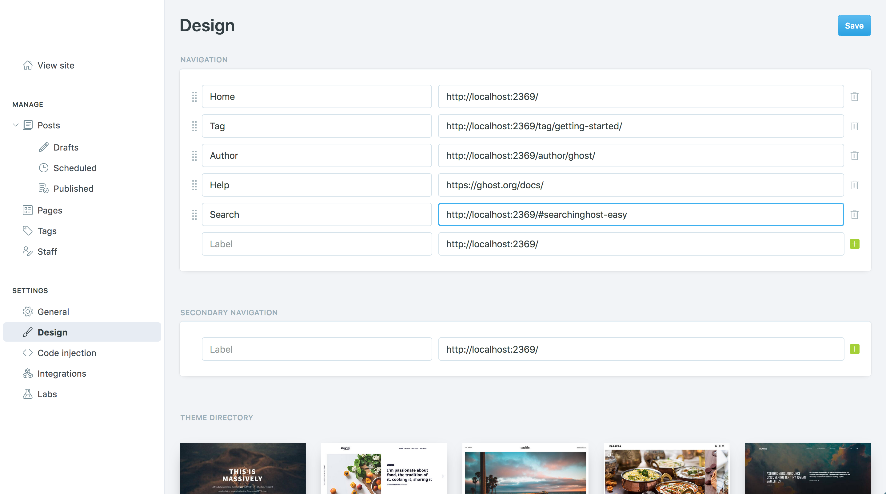
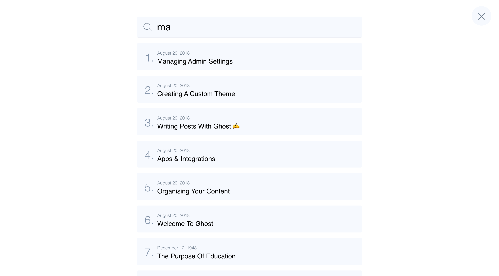
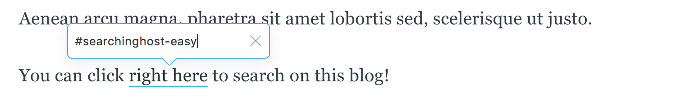

[](https://github.com/gmfmi/searchinghost-easy/releases)
[](https://www.jsdelivr.com/package/gh/gmfmi/searchinghost-easy)
[](https://github.com/gmfmi/searchinghost-easy/blob/master/LICENSE)


# SearchinGhostEasy

A Zero code & easy to setup search bar for Ghost CMS (blog).


## Description

SearchinGhostEasy is a wrapper around the original [SearchinGhost library](https://github.com/gmfmi/searchinGhost)
to make it accessible to any "non-developper" Ghost user.

Because we are not all born with design skills, several [search bar templates](#templates)
have already been made for you. They all use a responsive design so they fit perfectly on
any screen size, from mobile phones to 4K TVs.

Finally, by putting everything together in an HTML iframe, we get a super rich and smooth user experience!

Oh! I forgot to say the most important thing: **it works with ALL Ghost themes**! (casper, massively, nubia, ...)


## Installation

To install the search bar to your Ghost blog, follow these quick steps:

1. First, create a "custom integration". On the left side, go to the "integration" section, click on "+ Add custom integration" and give it the name "SearchinGhostEasy".
Ghost has generated your own and unique "Content API Key" (it should look like `ba094afe723d802f235af61d51`). Keep it somewhere, you will need it for the next step.
If you need more help, visit the official [Ghost custom integration](https://ghost.org/integrations/custom-integrations/) page.



2. Then, from the "Code Injection" section, copy/paste the following code chunk into the "Site Footer" area.  
DO NOT FORGET to replace the `<CONTENT_API_KEY>` placeholder with your own API key. Click on "save".

```html
<script src="https://cdn.jsdelivr.net/gh/gmfmi/searchinghost-easy@latest/dist/searchinghost-easy-basic.js"></script>
<script>
    new SearchinGhostEasy({
        contentApiKey: '<CONTENT_API_KEY>'
    });
</script>
```

*__note__: if you prefer to modify your custom theme, paste that into your `default.hbs` next to the
other scripts and it will work exactly the same way.*



3. Finally, add a link in the menu that open the search box. To do so, go to the "Design" section and add a new item. It can be in the "navigation" or "secondary navigation". You can name it with any label ("Search" feels natural) but the link **must** ends with `#searchinghost-easy`. Click on "save".



This is it, everything is setup! On you blog, a "search" button should shows up in the menu bar. Click it to see the magic happens! If you do not like the default search bar look, check out the next [template section](#templates) to change it 😃

Also, do not forget to check the [Question & Answers section](#qa) to get all the useful tips and the 
[configuration section](#configuration) for more advanced setup.


## Templates

SearchinGhostEasy comes in various graphical flavors. The template provided by default is called "Basic" but you
can easily switch to any other one.

To do so, refer to each template description and copy/paste the associated code example into your blog
`Code Injection > Site Footer` section. Basically, only the last part of the script name changes
(e.g. "searchinghost-easy-basic.js", "searchinghost-easy-backpack.js", ...).

Hopefully, more search bar templates are coming! If you would like to share one of your design
by contributing to this project, please feel free to contact me or to create an issue/PR.

---

### ✏️ Basic template

#### Screenshot



#### Demo

Live demo: https://gmfmi.github.io/searchinghost-easy/basic/


#### Installation

```html
<script src="https://cdn.jsdelivr.net/gh/gmfmi/searchinghost-easy@latest/dist/searchinghost-easy-basic.js"></script>
<script>
    new SearchinGhostEasy({
        contentApiKey: '<CONTENT_API_KEY>'
    });
</script>
```

---

### ✏️ Backpack template

#### Screenshot


#### Demo

Live demo: https://gmfmi.github.io/searchinghost-easy/backpack/


#### Installation

```html
<script src="https://cdn.jsdelivr.net/gh/gmfmi/searchinghost-easy@latest/dist/searchinghost-easy-backpack.js"></script>
<script>
    new SearchinGhostEasy({
        contentApiKey: '<CONTENT_API_KEY>'
    });
</script>
```


## Configuration

This section is reserved for more advanced users. By default, the configuration parameters
are carefully chosen so no extra configuration is needed.

If you need more control over SearchinGhostEasy, here are the available configuration options:

```js
new SearchinGhostEasy({
    contentApiKey: '<CONTENT_API_KEY>', // mandatory
    apiUrl: 'http://example.com',
    searchinghostOptions: {},
    searchinghostVersion: '1.3.3',
    zIndex: 200,
    debug: false
});
```

- **contentApiKey** (string, mandatory)
> The content API key. This value is mandatory and can be found in the custom integration details.
>
> example: `'06a02026a9f2dcf69f7e065d7c'`

- **apiUrl** (string)
> Set an API url different from the blog domain name. Can be useful for testing purpose.
> This option corresponds to `url` in the SearchinGhost library.
>
> example: `'http://example.com'`

- **searchinghostOptions** (object)
> Override SearchinGhost default configuration. This configuration will be merged with the
> ones provided by SearchinGhostEasy itself and the selected search template.
>
> To see all the available options, refer to the [SearchinGhost documentation](https://github.com/gmfmi/searchinGhost#options).
>
> example:
> ```js
> {
>     searchOn: 'submit',
>     limit: 5,
>     cacheMaxAge: 3600,
> }
> ```

- **searchinghostVersion** (string)
> Set the SearchinGhost version to use. Can be useful if a newer version has just been released.
>
> example: `'1.3.0'`

- **zIndex** (number)
> Set the HTML iframe element `z-index` to a specific value.
>
> default: `2147483647`

- **debug** (boolean)
> Set it to `true` to enable the debug mode. This will output the final SearchinGhost configuration used
> and also enable debug for SearchinGhost.
>
> default: `false`


## Q&A

### Will I get updates and improvements?

Yes, when a new version of SearchinGhostEasy is available you will get it automatically.

If you do not want this behaviour, replace `@latest` with a specific version in the URL. For example, with the
`basic` template, use: `https://cdn.jsdelivr.net/gh/gmfmi/searchinghost-easy@1.0.0/dist/searchinghost-easy-basic.js`
(replace `1.0.0` with the desired version).

### Can I use a search icon instead of a word?

Yes, you can do it by using a script or by updating your theme (see [right below](#can-i-use-it-in-a-custom-theme) for the theme option).

For the script option, the easier way is to use jQuery. If you don't know jQuery, no worry, just copy/paste the line
starting with `$("ul.nav")` **above** the SearchinGhostEasy section.

```html
<script>
    $("ul.nav").append('<li class="nav-search"><a href="#searchinghost-easy"><svg style="fill:#fff" width="14px" height="14px" xmlns="http://www.w3.org/2000/svg" viewBox="0 0 512 512"><path d="M508.875,493.792L353.089,338.005c32.358-35.927,52.245-83.296,52.245-135.339C405.333,90.917,314.417,0,202.667,0 S0,90.917,0,202.667s90.917,202.667,202.667,202.667c52.043,0,99.411-19.887,135.339-52.245l155.786,155.786 c2.083,2.083,4.813,3.125,7.542,3.125c2.729,0,5.458-1.042,7.542-3.125C513.042,504.708,513.042,497.958,508.875,493.792z M202.667,384c-99.979,0-181.333-81.344-181.333-181.333S102.688,21.333,202.667,21.333S384,102.677,384,202.667 S302.646,384,202.667,384z"/></svg></a></li>');
    
    new SearchinGhostEasy({
        contentApiKey: '<CONTENT_API_KEY>'
    });
</script>
```

Otherwise, if you prefer to add the icon in the secondary menu (next to the social links), use that one:

```html
<script>
    $(".social-links").append('<a class="social-link" href="#searchinghost-easy"><svg style="fill:#fff" width="16px" height="16px" xmlns="http://www.w3.org/2000/svg" viewBox="0 0 512 512"><path d="M508.875,493.792L353.089,338.005c32.358-35.927,52.245-83.296,52.245-135.339C405.333,90.917,314.417,0,202.667,0 S0,90.917,0,202.667s90.917,202.667,202.667,202.667c52.043,0,99.411-19.887,135.339-52.245l155.786,155.786 c2.083,2.083,4.813,3.125,7.542,3.125c2.729,0,5.458-1.042,7.542-3.125C513.042,504.708,513.042,497.958,508.875,493.792z M202.667,384c-99.979,0-181.333-81.344-181.333-181.333S102.688,21.333,202.667,21.333S384,102.677,384,202.667 S302.646,384,202.667,384z"/></svg></a>');

    new SearchinGhostEasy({
        contentApiKey: '<CONTENT_API_KEY>'
    });
</script>
```

In both cases, if you need to modify the icon color to better match your Ghost theme,
update the `fill` property with the appropriate value. For example: `style="fill:#fc03ec"` to get pink.

### Can I use it in a custom theme?

Yes, to customize your theme, follow this [Ghost guide](https://ghost.org/docs/api/v3/handlebars-themes/helpers/navigation/) to modify the menu as needed.

Then, the only requirement to make SearchinGhostEasy works is to use `#searchinghost-easy` as value in the `href` of your link.

For example, your `partials/navigation.hbs` file could be:

```html
<ul class="nav" role="menu">
    {{#foreach navigation}}
    <li class="{{link_class for=(url) class=(concat "nav-" slug)}}" role="menuitem"><a href="{{url absolute="true"}}">{{label}}</a></li>
    {{/foreach}}
    <li class="search-icon" role="menuitem"><a href="#searchinghost-easy">{{> "icons/search"}}</a></li>
</ul>
```

with `partials/icons/search.hbs` containing:

```html
<svg xmlns="http://www.w3.org/2000/svg" xmlns:xlink="http://www.w3.org/1999/xlink" viewBox="0 0 512 512"><path d="M508.875,493.792L353.089,338.005c32.358-35.927,52.245-83.296,52.245-135.339C405.333,90.917,314.417,0,202.667,0 S0,90.917,0,202.667s90.917,202.667,202.667,202.667c52.043,0,99.411-19.887,135.339-52.245l155.786,155.786 c2.083,2.083,4.813,3.125,7.542,3.125c2.729,0,5.458-1.042,7.542-3.125C513.042,504.708,513.042,497.958,508.875,493.792z M202.667,384c-99.979,0-181.333-81.344-181.333-181.333S102.688,21.333,202.667,21.333S384,102.677,384,202.667 S302.646,384,202.667,384z"/></svg>
```

### Can I use a link anywhere other than in the menu?

For sure, any link pointing to `#searchinghost-easy` will open the search box pop-up. You can create
one or multiple links on the same page, for example in a Ghost post or directly in a theme `.hbs` file.

When writing an article, you can simply create a link this way:  



In HTML, a SearchinGhostEasy link is nothing more than:
```html
<a href="#searchinghost-easy">click to search</a>
```


## Credits

- Thank you to [ACERLR8](https://acelr8.jobs/blog/), their search bar inspired the "Basic" template
- [Back to Pack](https://www.backtopack.fr), the original source of the "Backpack" template